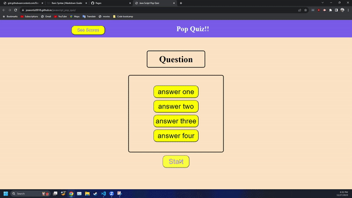

# JavaScript_pop_quiz

## Description

This is a pop quiz testing your knowledge of basic JavaScript Syntax made with JavaScript!! 
This project uses basic JavaScript to:
 1. Start a timer when the start button is pressed 
 2. Propagate questions and possible answers when the start button is pressed
 3. If timer reaches 0 before quiz is completed it will stop the quiz and reload the page
 4. If the user finishes the quiz they are promoted to Input User's name and told their Score
 5. Score board is shown with user name and their score of past users locally stored in users browser
 6. Able to clear score board with button press that clears locally stored data

All this is possible with basic JavaScript!!! Amazing 

## Getting Started
To get started simply press the start button and continue with the quiz if you wanna see previous scores press the see scores button. See if you can get a highScore! see if you can clear the leader board

## Contact information
Email:<joseortiz0918@gmail.com> 
github:<https://github.com/Joseortiz0918>

## License

This project is licensed under the MIT License - see the LICENSE.md file for details

